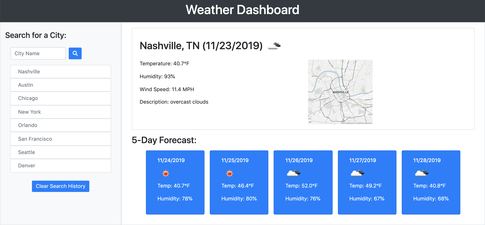
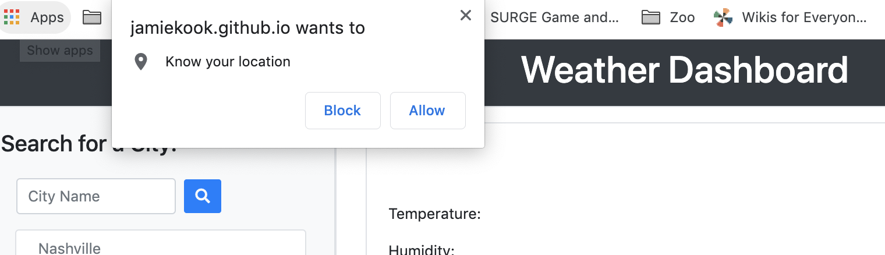

# WeatherDashboard

This web application displays both current weather and the 5 day forecast of user-selected cities.

## Installation

Clone folder onto your own computer by forking the repository and using the "Clone or download" button on github.  

## Functionality 

### Selection of cities
Users can select a city by either inputting the city's name in the search bar or by clicking on one of the cities listed. Upon clicking a search or city button, weather data will be gathered for the selected city. 

### Current weather display
This application displays the city, state, date, and map of the location for each inputted city. For the selected city, the current temperature, humidity, wind-speed, a weather icon, and a short weather description. Information is diplayed on the webpage. 

### Five-day Forecast
The 5-day forecast is displayed below the city's current weather. The forecast shows the predicted weather for the following 5 days at 3pm each day. The date of the forecast is displayed along with a weather icon, temperature and humidity. 

### Search history- City listings
The application defaults to list 8 popular cities for the user to select. This list also functions as a search history, updating to include any new cities that the user searches for. The list displays the city name that is called from OpenWeather's api when a city is searched, which prevents lettercase differences from adding the same city multiple times to the list. The search history holds a maximum of 8 non-repeating values. The search history can be cleared by clicking the "Clear Search History" button below the list. When cleared, the default city list will repopulate the display. 

### Automatic user current-location weather display
Upon loading the page, the application captures the user's geographic coordinates. This information is used to determine the weather data for the user's current location. Weather information is then displayed on the webpage. 

## Coding

*   This project utilizes javascript and css.
*   Bootstraps 4 is utilized for the styling and for media responsiveness.
*   jQuery selects and mainpulates the DOM. 
*   Local storage saves search history data. 
*   Moment.js capture sthe current date.
*   Mapquest's geocoding api determines the address of the various location from given coordinates, providing the city and state to the application. [https://developer.mapquest.com/documentation/](https://developer.mapquest.com/documentation/)
*   Mapquest's static map api delivers the map of each location to the application based on the city and state.
*   OpenWeather's weather api provides all weather information for each city as well as the dates on the 5-day forecast. [https://openweathermap.org/api](https://openweathermap.org/api)
*   The geolocation api determines user's current geographic coordinates. 

## Meta 

Jamie Kook - kookjc6@gmail.com

[https://https://jamiekook.github.io/WeatherDashboard/](https://jamiekook.github.io/WeatherDashboard/)